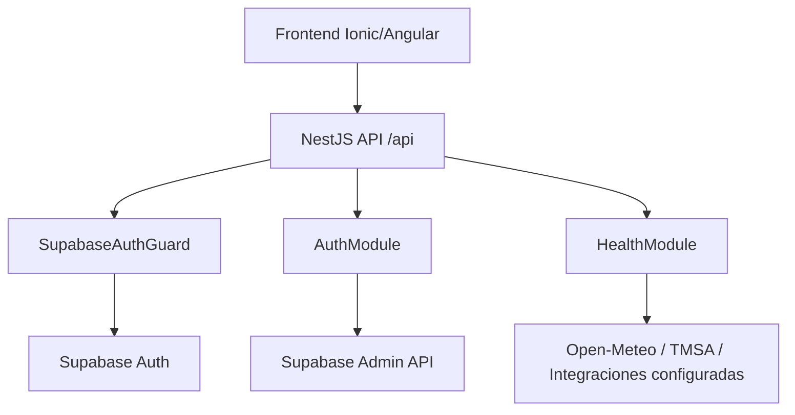
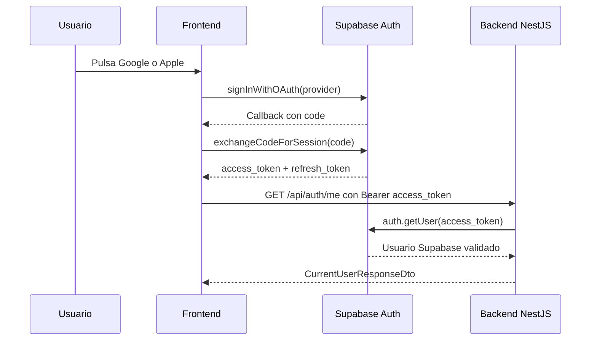
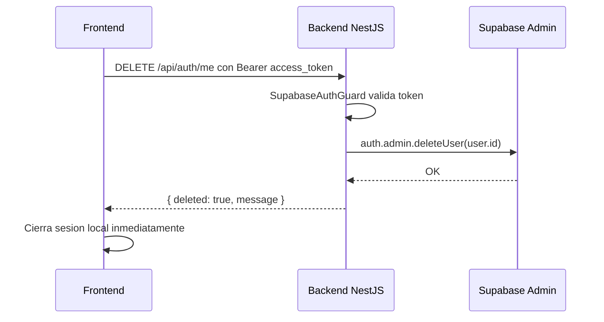
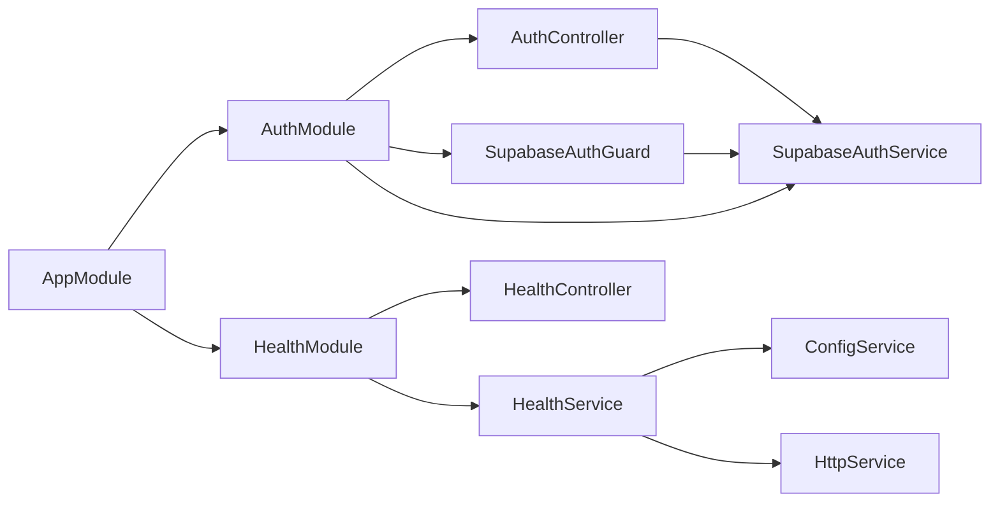

# Arquitectura Backend

## Arquitectura general

El backend es una API monolitica modular en NestJS para el sistema Menorca AI
Agent. La autenticacion la delega en Supabase Auth: NestJS no emite tokens, no
almacena passwords y actua como resource server que valida access tokens de
Supabase.

La estructura actual aplica una base de Clean Architecture por modulo:

```txt
domain          Entidades y modelos de dominio
application     Casos de uso futuros
infrastructure  Clientes externos y adaptadores
presentation    Controllers, guards y DTOs HTTP
shared          Configuracion, roles y utilidades transversales
```

En el estado actual existen los modulos `auth` y `health`, mas el endpoint raiz
de smoke test.



## Tecnologias utilizadas

- NestJS 11.
- TypeScript 5.7.
- Supabase JS SDK para validar usuarios y borrar cuentas.
- Supabase Auth como proveedor de identidad.
- Swagger/OpenAPI con `@nestjs/swagger`.
- `class-validator` y `class-transformer` para DTOs y environment validation.
- `@nestjs/config` para variables de entorno.
- `@nestjs/axios` y Axios para probes HTTP.
- Jest, Supertest y ts-jest para unit/e2e tests.
- ESLint y Prettier.

## Lo que ya esta hecho

- Prefijo global `/api`.
- Swagger disponible en `/docs`.
- `ValidationPipe` global con `whitelist`, `forbidNonWhitelisted` y
  `transform`.
- Validacion tipada de variables de entorno con `EnvironmentDto`.
- Endpoint raiz `GET /api`.
- Endpoint operacional `GET /api/health`.
- Endpoints de auth:
  - `GET /api/auth/providers`
  - `GET /api/auth/me`
  - `DELETE /api/auth/me`
- Auth con Supabase access token.
- Proveedores OAuth permitidos: Google y Apple.
- Eliminacion de cuenta con service role key en backend.
- Base de roles: `guest`, `user`, `paid_user`, `admin`.
- `RolesGuard` y decorador `@Roles(...)`.
- Tests unitarios y e2e iniciales.

## Flujo de datos

### Login y acceso protegido



### Eliminacion de cuenta



## Estructura de carpetas

```txt
src
  app.controller.ts
  app.module.ts
  app.service.ts
  main.ts
  modules
    auth
      auth.controller.ts
      auth.module.ts
      current-user.decorator.ts
      domain
        authenticated-user.entity.ts
      dto
        auth-provider.dto.ts
        current-user-response.dto.ts
        delete-account-response.dto.ts
      supabase-auth.guard.ts
      supabase-auth.service.ts
    health
      dto
        health-response.dto.ts
        service-health.dto.ts
      health.controller.ts
      health.module.ts
      health.service.ts
  shared
    auth
      authenticated-request.interface.ts
      role.enum.ts
      roles.decorator.ts
      roles.guard.ts
    config
      environment.dto.ts
      validate-environment.ts
test
  app.e2e-spec.ts
```

## Como se comunican los modulos

- `AppModule` importa `ConfigModule`, `AuthModule` y `HealthModule`.
- `AuthController` recibe peticiones HTTP y delega en `SupabaseAuthService`.
- `SupabaseAuthGuard` usa `SupabaseAuthService` para validar tokens y adjunta el
  usuario normalizado a `request.user`.
- `CurrentUser` lee `request.user` para controllers protegidos.
- `RolesGuard` lee metadata del decorador `@Roles(...)` y compara contra
  `request.user.roles`.
- `HealthController` delega en `HealthService`.
- `HealthService` lee config desde `ConfigService` y usa `HttpService` solo para
  probes publicos seguros.



## Tecnologias previstas pero aun no implementadas

Estas tecnologias estan consideradas en variables de entorno, health checks o
roadmap, pero aun no tienen modulos de negocio completos:

- Stripe para pagos.
- Milvus para base vectorial/RAG.
- DeepSeek, Gemini, Groq y OpenAI para orquestacion IA/voz.
- Open-Meteo para clima.
- TMSA para buses.
- Supabase Database/RLS para perfiles, roles, cuotas, pagos y ratings.
